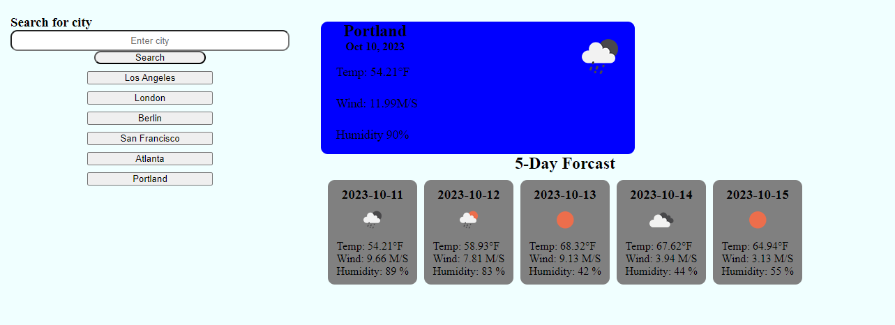

# Weather Dashboard

## Discription
This weather app will make it easy to get the current weather for any city in the world as well as a 5-day forcast. After searching for a city the history will be saved so that you can go back to any city you searched for quickly.

## Features
- Displays current weather for any city.
- Displays five day forcast.
- Tracks search history for easy referencing.

*Preview of my work*

Technology Used         | Resource URL           | 
| ------------- |:-------------:| 
| HTML       | [https://developer.mozilla.org/en-US/docs/Web/HTML](https://developer.mozilla.org/en-US/docs/Web/HTML) | 
| CSS        | [https://developer.mozilla.org/en-US/docs/Web/CSS](https://developer.mozilla.org/en-US/docs/Web/CSS)      |   
| Git        | [https://git-scm.com/](https://git-scm.com/)     |    
| JavaScript | [https://developer.mozilla.org/en-US/docs/Web/JavaScript](https://developer.mozilla.org/en-US/docs/Web/JavaScript) |
| Day.js | [https://day.js.org/](https://day.js.org) |

 
 [Visit the Deployed Site](https://andrewchall92.github.io/weather-app/)

 ## License
 This project is licensed under the [MIT License](LICENSE).